# CustomerTaxationSwingV3
# TAX PAYER REGISTRATION SYSTEM
## APP main Page
- This page act as the connector of all operations which will be done by the system under all classes.
- It has the buttons directing to each operation among CRUD (Create, Read, Update and Delete).

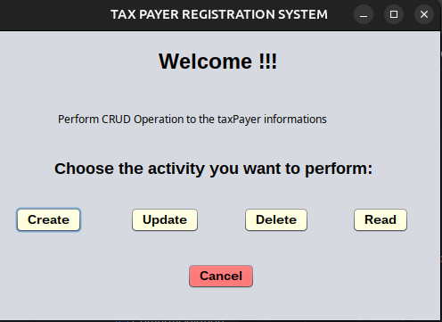

- When the user click on cancel it will pop a message to thank him for using the system.

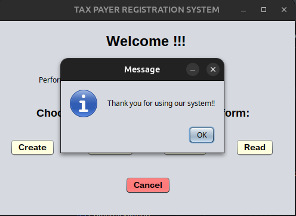

### CREATE PAGE AND READ ALL DATA
- If the user hit Create Button it will direct him to the page which will allow him to create a new TaxPayer.

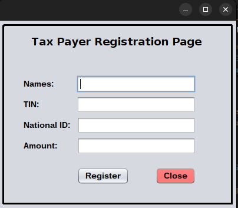

- Before insert or Create Operation let try to check for a read Operation and see the output.
i.e: They will be no data because because we didn't insert any tax payer. 

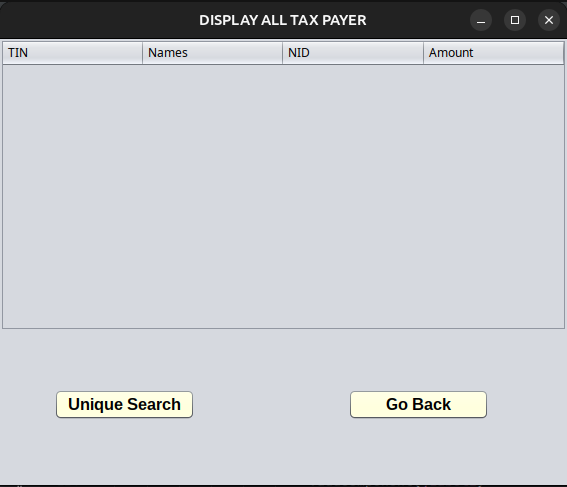

- Then after Create now we can see the Tax Payer throught the same above Read operation.

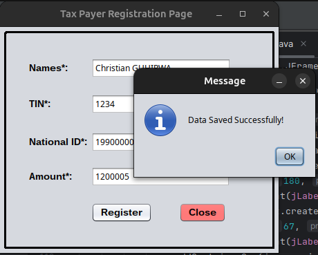

### DELETE DATA and SEARCH DATA
- Before Delete lets first add more data and Display them before and after delete to see the change

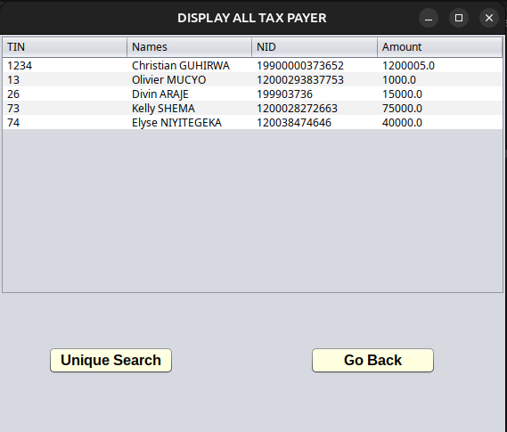

- Lets delete data with an TIN of 26. Search and if found confirm to delete.....EAZY !!

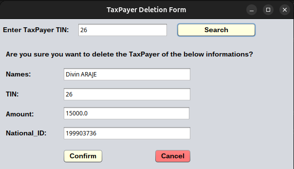 
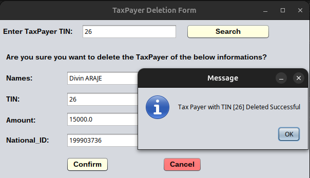

Then I we display all data or try to seach a unique information with the same TIN it will be no where to be founded.

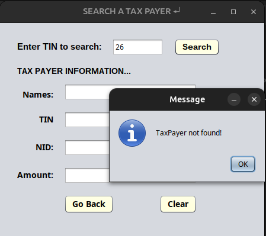

### UPDATE DATA and SEARCH DATA
- Lets use data with TIN of 73 and update name from `Kelly SHEMA` to `SHEMA Elon Musk Kelly`.
- Before update
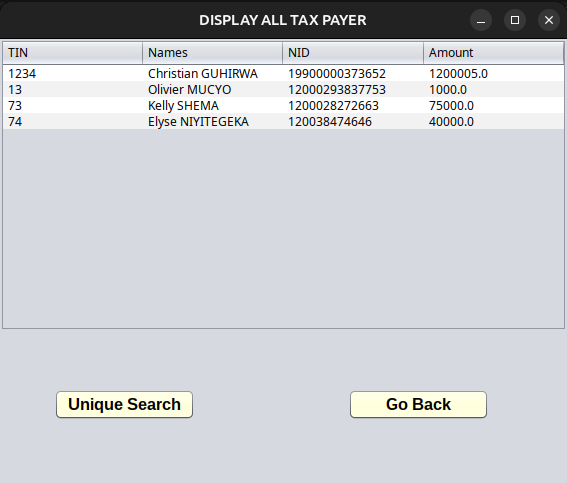
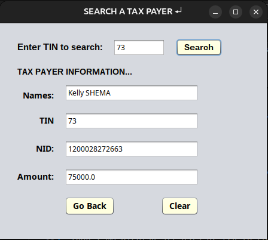

- During Update. Check if data exist, ADD Updated Information and then confirm.
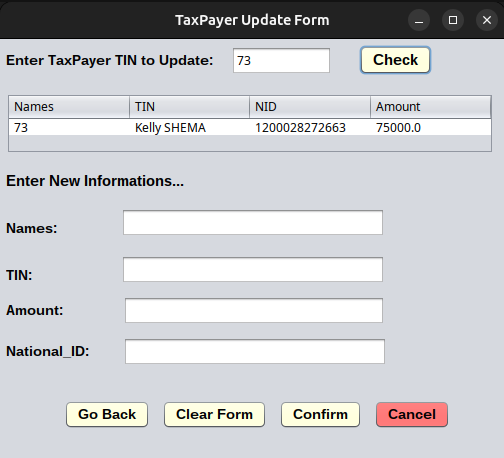
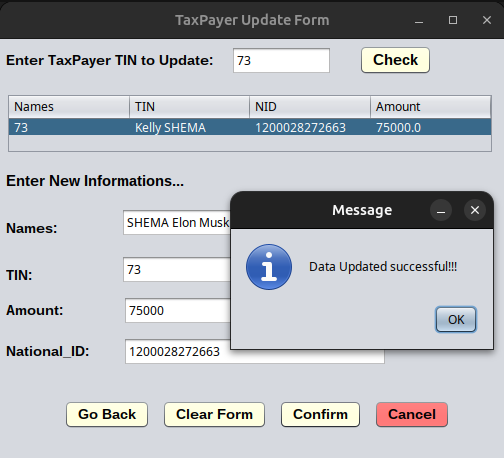

-After Delete the data is Updated successfully!!!
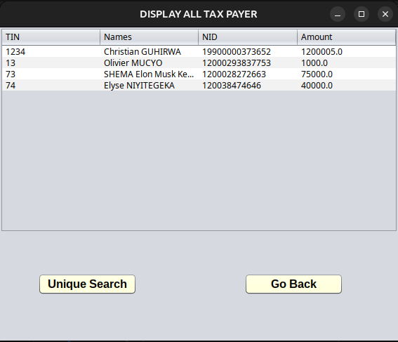
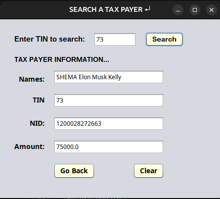

Done!!! Thank you! 😊🎉
    

